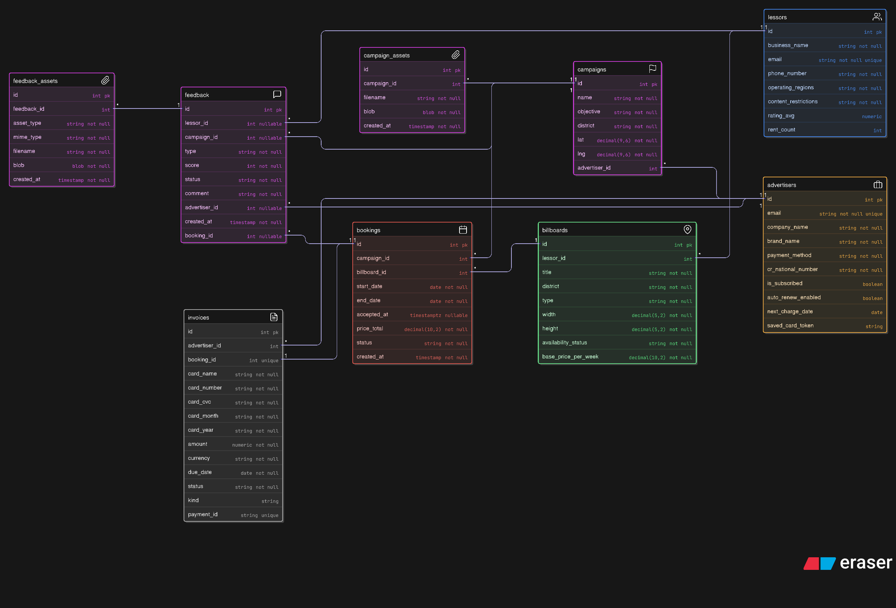
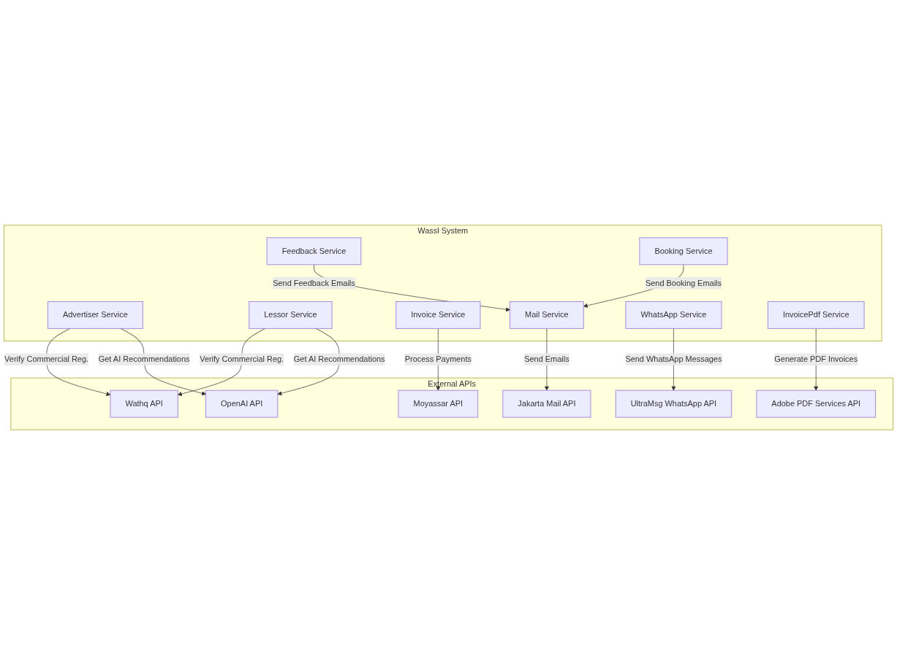

# Wassl 🚀

## About the Project

**Wassl (وصل)** هو مشروع ذكي يربط **المعلنين** بـ **أصحاب اللوحات الإعلانية** بكل سهولة.

فكرته كذا: بدل ما يدوخ المعلن ويدور بنفسه، التطبيق يوصله مباشرة لصاحب اللوحة المناسبة ويخليه يطلق حملته بسرعة.

يعني تخيلها كأنها **تطبيق توصيل**:

- بس بدل ما نوصل وجبات  نوصل **إعلانات 📢**.

- الذكاء الاصطناعي يعطي أفكار، استراتيجيات، ونصائح.

- الدفع يتم عن طريق Moyassar.

- التحقق من السجل التجاري يتم عبر Wathq.

- التواصل مع المعلن يتم عن طريق واتساب UltraMsg أو إيميل عبر Jakarta Mail.

**بالمختصر:**

> Wassl = **الإعلانات أوصل لك أسرع، أسهل، وأذكى** 🤖

---

## Entity Relation Diagram

---
##

---

# My Endpoints

#### /api/v1/advertiser

1. Request OTP for Advertiser Action
    * Full Path: /api/v1/advertiser/request-otp/{id}/{actionType}
    * HTTP Method: POST
    * Details: This endpoint requests an OTP for a specific advertiser action. It takes the advertiser id and actionType from the
      path variables. It uses advertiserService.requestOtpForAdvertiserAction and returns an ApiResponse.
    * Using: Java Random Class with Map

2. Get Advertiser Campaigns
    * Full Path: /api/v1/advertiser/{id}/campaigns
    * HTTP Method: GET
    * Details: This endpoint retrieves all campaigns associated with a specific advertiser. It takes the advertiser id from the path
      variable. It uses advertiserService.getAdvertiserCampaign and returns a list of campaigns.
    * Using: Hibernate with JPA Repositories 

  ---

#### /api/v1/lessor

1. Request OTP for Lessor Action
    * Full Path: /api/v1/lessor/request-otp/{id}/{actionType}
    * HTTP Method: POST
    * Details: This endpoint requests an OTP for a specific lessor action. It takes the lessor id and actionType from the path
      variables. It uses lessorService.requestOtpForLessorAction and returns an ApiResponse.
    * Using: Java Random Class with Map

2. Get Billboards by Lessor
    * Full Path: /api/v1/lessor/{id}/billboards
    * HTTP Method: GET
    * Details: This endpoint retrieves all billboards associated with a specific lessor. It takes the lessor id from the path
      variable. It uses lessorService.getLessorBillboards and returns a list of billboards.
    * Using: Hibernate with JPA Repositories

3. Get Lessor Invoices
    * Full Path: /api/v1/lessor/{id}/invoices
    * HTTP Method: GET
    * Details: This endpoint retrieves all invoices associated with a specific lessor. It takes the lessor id from the path
      variable. It uses lessorService.getLessorInvoices and returns a list of invoices.
   * Using: Hibernate with JPA Repositories

  ---

#### /api/v1/invoice

1. Get Payment Status
    * Full Path: /api/v1/invoice/get_status/{id}
    * HTTP Method: GET
    * Details: This endpoint retrieves the payment status of an invoice. It takes the invoice id from the path variable. It uses
      invoiceService.getPaymentStatus and returns the payment status.
    * Using: Spring Framework HttpHeaders with Moyasar payment Api

2. Process Payment for Booking
    * Full Path: /api/v1/invoice/pay/{bookingId}
    * HTTP Method: POST
    * Details: This endpoint processes payment for a booking. It takes the bookingId from the path variable and an InvoiceDTO from
      the request body. It uses invoiceService.processPayment and returns the result of the payment process.
    * Using: Spring Framework HttpHeaders with Moyasar payment Api, Jakarta Mail with Gmail SMTP, Adobe PDF Services API. 

3. Handle Payment Callback
    * Full Path: /api/v1/invoice/callback
    * HTTP Method: PUT
    * Details: This endpoint handles payment callbacks. It takes id, status, amount, and message as request parameters. It uses
      invoiceService.handlePaymentCallback to process the callback and returns an ApiResponse.
    * Using: Hibernate to change the status of booking

  ---

#### /api/v1/feedback

1. Get Opened Feedbacks
    * Full Path: /api/v1/feedback/get/opened
    * HTTP Method: GET
    * Details: This endpoint retrieves all opened feedbacks. It uses feedbackService.getOpenedFeedbacks and returns a list of
      feedbacks.
    *  Using: Hibernate with JPA Repositories.

2. Closing Feedback
    * Full Path: /api/v1/feedback/{id}/close
    * HTTP Method: PUT
    * Details: This endpoint closes a feedback identified by its id. It takes the id from the path variable and a Mail object from
      the request body. It uses feedbackService.closingFeedback and returns an ApiResponse.
    * Using: Jakarta Mail with Gmail SMTP and Hibernate with JPA Repositories

3. Get Closed Feedbacks
    * Full Path: /api/v1/feedback/get/closed
    * HTTP Method: GET
    * Details: This endpoint retrieves all closed feedbacks. It uses feedbackService.getClosedFeedback and returns a list of
      feedbacks.
    *  Using: Hibernate with JPA Repositories

  ---

#### /api/v1/booking

1. Request OTP for Booking Action
    * Full Path: /api/v1/booking/request-otp/{id}/{actionType}
    * HTTP Method: POST
    * Details: This endpoint requests an OTP for a specific booking action. It takes the booking id and actionType from the path
      variables. It uses bookingService.requestOtpForBookingAction and returns an ApiResponse.
    * Using: Java Random Class with Map

2. Get Pending Bookings
    * Full Path: /api/v1/booking/{lessorId}/bookings/pending
    * HTTP Method: GET
    * Details: This endpoint retrieves all pending bookings for a specific lessor. It takes the lessorId from the path variable. It
      uses bookingService.findPendingBookings and returns a list of pending bookings.
    * APIs Used: Hibernate with JPA Repositories.

3. Accept Booking
    * Full Path: /api/v1/booking/{lessorId}/bookings/{bookingId}/accept
    * HTTP Method: PUT
    * Details: This endpoint accepts a booking for a specific lessor. It takes the lessorId and bookingId from the path variables
      and an otp from the request parameter. It uses bookingService.acceptBooking and returns an ApiResponse.
    * Using: Jakarta Mail with Gmail SMTP and Otp service and Hibernate with JPA Repositories.

---

## Scheduled Tasks

This section outlines the methods annotated with `@Scheduled` that run automatically at specified intervals.

### BookingService.java

- `updateBookingStatusBasedOnEndDate()`: This method runs daily at midnight (`cron = "0 0 * * * ?"`) to update the status of bookings whose end date has passed to "completed".

### LessorService.java

- `remindPendingBooking()`: This method runs daily at midnight (`cron = "0 0 0 * * *"`) to remind lessors about pending bookings via WhatsApp.

---

# External APIs Used

* **Wathq API (وثق)** → للتحقق من السجل التجاري إذا كان نشطًا أم لا.

* **Jakarta Mail API** → لإرسال البريد الإلكتروني من داخل النظام.

* **UltraMsg WhatsApp API** → للتواصل مع المعلنين عبر واتساب.

* **Moyassar API** → لمعالجة عمليات الدفع الإلكتروني (الاشتراكات).

* **OpenAI API** → لتوليد النصائح، التحليلات، الأفكار، والتوصيات الذكية.

* **Adobe PDF Services API** → لإنشاء فواتير واضحة للمستخدمين

---
